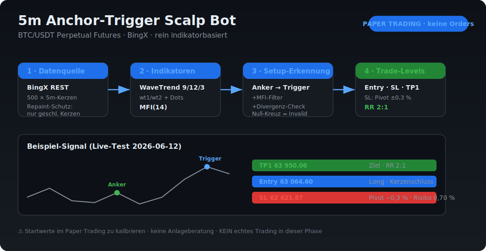

# Mick Trading Bot

**5m Anchor-Trigger Scalp** für **BTC/USDT Perpetual Futures** (BingX) — rein indikatorbasiert.

> ⚠️ **Status: Paper Trading.** Der Bot sendet **keine** echten Orders. Aktuell stehen
> Datenanbindung, Indikatoren und Setup-Erkennung. Keine Anlageberatung.



👉 **Interaktive Vision:** [`docs/vision.html`](docs/vision.html) im Browser öffnen.

---

## Was der Bot macht

Er übersetzt die Jason-Casper-„Anchor-Trigger"-Logik in **exakte, prüfbare Regeln** und
durchläuft pro 5-Minuten-Kerze diese Pipeline:

| Schritt | Modul | Aufgabe |
|--------|-------|---------|
| 1 · Daten | [`src/exchange/bingx_client.py`](src/exchange/bingx_client.py) | 500 × 5m-Kerzen von BingX, **nur geschlossene** (Repaint-Schutz) |
| 2 · Indikatoren | [`src/indicators/`](src/indicators) | WaveTrend (9/12/3, wt1/wt2 + Dots) · MFI(14) |
| 3 · Setup | [`src/strategy/setup_detector.py`](src/strategy/setup_detector.py) | Anker→Trigger + MFI-Filter + [Divergenz](src/strategy/divergence_detector.py) |
| 4 · Levels | [`src/strategy/trade_levels.py`](src/strategy/trade_levels.py) | Entry · Stop Loss · Take Profit (RR 2:1) |

## Strategie-Regeln (Kurzfassung)

| Element | Regel |
|---------|-------|
| **Anker** | erste WaveTrend-Welle jenseits ±60 |
| **Trigger** | folgende Welle mit Dot, Extrem näher an 0 als Anker, `|wt1| ≥ 50` |
| **MFI-Filter** | `MFI(Trigger) > MFI(Anker)` — entfällt bei aktiver Divergenz |
| **Entry** | Schluss der Trigger-Kerze |
| **Stop Loss** | Pivot (5 Kerzen) ± 0,3 %, min. 0,3 % Abstand |
| **Take Profit** | volle Position bei **RR 2:1** |
| **Invalidierung** | wt1 kreuzt die Null-Linie |
| **Risiko / Hebel** | 1 % pro Trade · 3× · max. 1 Position · −3 % Tagesstopp |

Vollständige Spezifikation: [`Jason Casper Markdown/strategy_spec_5m_anchor_trigger.md`](Jason%20Casper%20Markdown/strategy_spec_5m_anchor_trigger.md)

---

## Setup

```bash
pip install -r requirements.txt
```

**API-Keys** (nur für späteres Live-Trading nötig — Paper Trading läuft über öffentliche Endpunkte):

```bash
# .env im Projekt-Root anlegen (wird NICHT committed)
BINGX_API_KEY=dein_api_key
BINGX_SECRET_KEY=dein_secret_key
```

> 🔒 `.env` ist via `.gitignore` ausgeschlossen. Keys gehören **niemals** in den Code.

## Verwendung

```bash
# BingX-Verbindung testen + komplette Pipeline auf Live-Daten
python scripts/test_bingx_connection.py

# Indikatoren gegen TradingView/Market-Cipher-Chart abgleichen
python scripts/verify_indicators.py
```

`test_bingx_connection.py` lädt Kerzen, zeigt einen BingX↔Binance-Spread-Check
und meldet, ob aktuell ein gültiges Setup vorliegt.

## Konfiguration

Alle Parameter (Schwellen, Pivot-Fenster, Risiko, …) liegen in
[`config/config.yaml`](config/config.yaml) — kalibrierbar **ohne Code-Änderung**.
Mit `KALIBRIEREN` markierte Werte sind Startannahmen für das Paper Trading.

## Projektstruktur

```
src/
  exchange/   BingX-Anbindung (lesend)
  indicators/ WaveTrend, MFI
  strategy/   Setup-Erkennung, Divergenz, Trade-Levels
scripts/      Test- & Verifikationsskripte
config/       config.yaml
docs/         Vision (SVG + HTML)
```

---

> **Disclaimer:** Software für Bildungs-/Forschungszwecke. Keine Anlageberatung.
> Krypto-Trading ist hochriskant. Mehrere Strategie-Parameter sind unkalibrierte
> Startannahmen. In der aktuellen Phase werden **keine echten Orders** ausgeführt.
