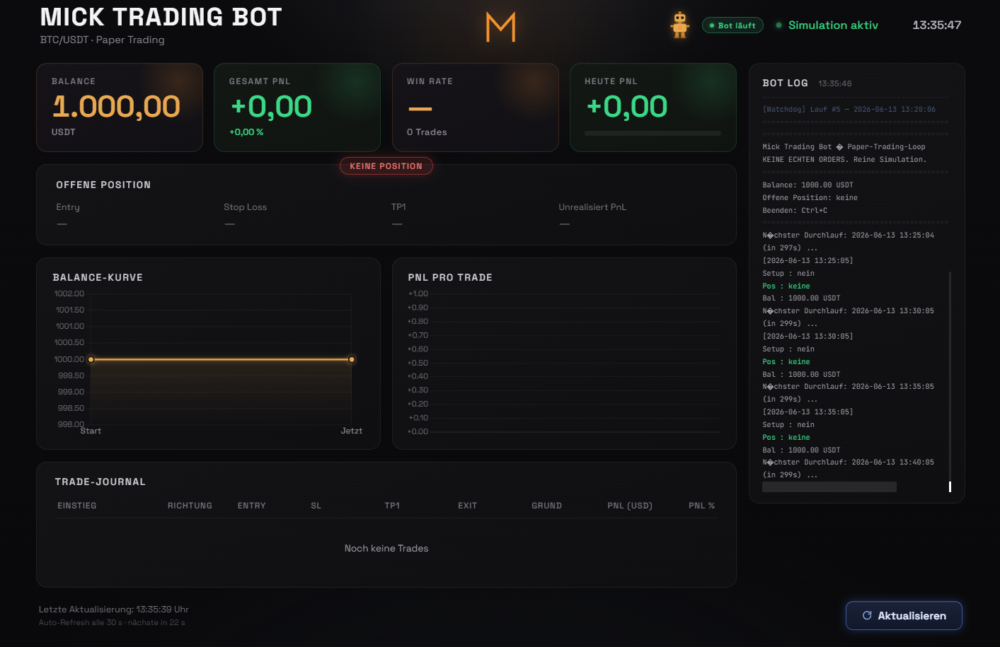

# Mick Trading Bot

**5m Anchor-Trigger Scalp** für **BTC/USDT Perpetual Futures** (BingX) — rein indikatorbasiert, vollautomatisch.

> ⚠️ **Status: Paper Trading — keine echten Orders.** Reine Simulation zur Kalibrierung. Keine Anlageberatung.

---

## Dashboard



> *Live-Dashboard mit echten Paper-Trading-Daten. Zeigt Live-Daten aus `data/state.json` + `data/trades.csv`.*

Das Live-Dashboard läuft lokal im Browser und aktualisiert sich automatisch alle 30 Sekunden:

```bash
# HTTP-Server starten (aus dem Projektordner)
python -m http.server 8080
```

Dann im Browser öffnen: **`http://localhost:8080/scripts/dashboard.html`**

| Feature | Details |
|---------|---------|
| Balance-Kurve | Chart.js Linienchart, blau |
| PNL pro Trade | Balken grün/rot je Ergebnis |
| Offene Position | Entry · SL · TP1 live |
| Trade-Journal | alle Trades aus `data/trades.csv` |
| Auto-Refresh | alle 30 s, Countdown sichtbar |
| Bot Log | Live-Sidebar, aktualisiert alle 8 s |
| Watchdog | Auto-Neustart bei Absturz, Badge im Header |
| Design | Space Grotesk, Dark Mode, Glow-Cards |

👉 **Projektübersicht (visuell):** [`docs/vision.html`](docs/vision.html) im Browser öffnen.

---

## Bot starten

```bash
# Paper-Trading-Loop (läuft alle 5 Minuten, Ctrl+C zum Stoppen)
python scripts/run_paper_loop.py

# Unit-Tests (27 Tests, kein Netz nötig)
python scripts/test_paper_engine.py
```

---

## Pipeline — pro 5m-Kerze

| Schritt | Modul | Aufgabe |
|--------|-------|---------|
| 1 · Daten | [`src/exchange/bingx_client.py`](src/exchange/bingx_client.py) | 500 × 5m-Kerzen von BingX, nur geschlossene (Repaint-Schutz) |
| 2 · Indikatoren | [`src/indicators/`](src/indicators) | WaveTrend (9/12/3, wt1/wt2 + Dots) · MFI(14) |
| 3 · Setup | [`src/strategy/setup_detector.py`](src/strategy/setup_detector.py) | Anker→Trigger + MFI-Filter + Divergenz |
| 4 · Ausführung | [`src/paper/paper_engine.py`](src/paper/paper_engine.py) | Entry · SL · TP1 · Size · Journal |

## Strategie-Regeln

| Element | Regel |
|---------|-------|
| **Anker** | erste WaveTrend-Welle jenseits ±60 |
| **Trigger** | folgende Welle mit Dot, Extrem näher an 0, `\|wt1\| ≥ 50` |
| **MFI-Filter** | `MFI(Trigger) > MFI(Anker)` — entfällt bei Divergenz |
| **Entry** | Schluss der Trigger-Kerze |
| **Stop Loss** | Pivot (5 Kerzen) ± 0,3 %, min. 0,3 % Abstand |
| **Take Profit** | volle Position bei RR 2:1 |
| **Invalidierung** | wt1 kreuzt Null-Linie |
| **Risiko / Hebel** | 1 % pro Trade · 3× Hebel · max. 1 Position · −3 % Tagesstopp |

## Setup

```bash
pip install -r requirements.txt
```

```bash
# .env im Projekt-Root anlegen (wird NICHT committed)
BINGX_API_KEY=dein_api_key
BINGX_SECRET_KEY=dein_secret_key
```

> `.env` ist via `.gitignore` ausgeschlossen. API-Keys gehören niemals in den Code.

## Konfiguration

Alle Parameter in [`config/config.yaml`](config/config.yaml) — kalibrierbar ohne Code-Änderung.

## Projektstruktur

```
src/
  exchange/      BingX REST-Wrapper (read-only)
  indicators/    WaveTrend, MFI
  strategy/      Setup-Erkennung, Divergenz, Trade-Levels
  paper/         Paper-Engine, Journal, Position
scripts/
  run_paper_loop.py     Haupt-Loop (5m-Takt)
  dashboard.html        Live-Dashboard (Apple Dark Mode)
  test_paper_engine.py  27 Unit-Tests
config/
  config.yaml    alle Parameter
data/            gitignored — state.json, trades.csv
docs/
  vision.html    Projektübersicht (visuell)
```

---

> **Disclaimer:** Software für Bildungs-/Forschungszwecke. Keine Anlageberatung.
> Krypto-Trading ist hochriskant. In der aktuellen Phase werden **keine echten Orders** ausgeführt.
